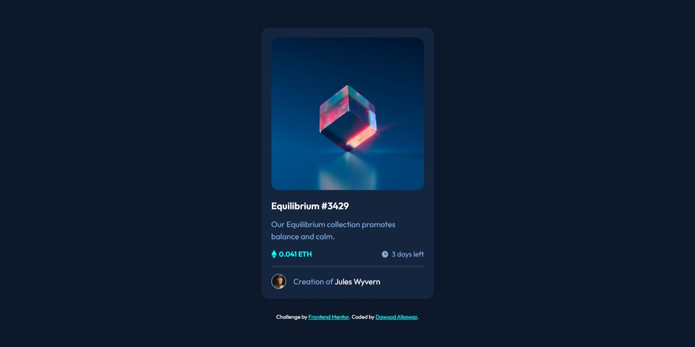
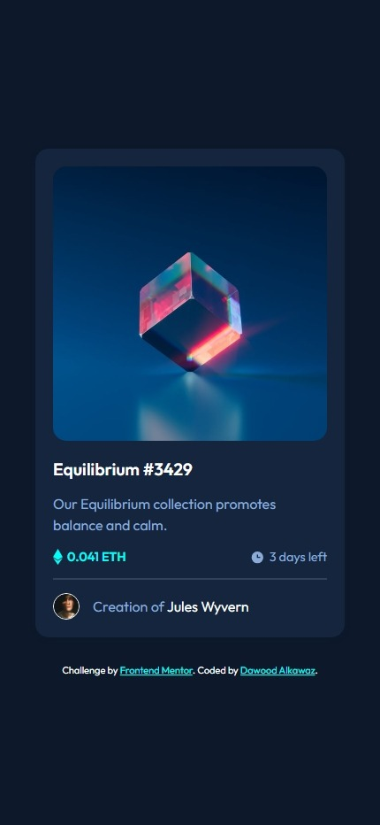

# Frontend Mentor - NFT preview card component solution

This is a solution to the [NFT preview card component challenge on Frontend Mentor](https://www.frontendmentor.io/challenges/nft-preview-card-component-SbdUL_w0U).

## Table of contents

- [Overview](#overview)
  - [Screenshot](#screenshot)
- [My process](#my-process)
  - [Built with](#built-with)
  - [What I learned](#what-i-learned)

## Overview

This as the NFT preview card design challenge from [Frontend Mentor](https://www.frontendmentor.io).

[**Live Preview**](https://xdv99.github.io/Frontend-mentor-NFT-preview-card-component/)

### Screenshot

|  |  |
|:-----------------------:|:-----------------------:|
|     Desktop Design  |    Mobile Design  |


## My process

### Built with

- **Flexbox** for centering the content in whatever screen and basic layout.
- **Position** to align the overlay perfectly.


### What I learned

Using **Flexbox** & **Position** to achieve the overlay effect.
```css
.card__img:hover .view {
    display: flex;
}

.card__img .view {
    display: none;
    justify-content: center;
    align-items: center;
    position: absolute;
    top: 0;
    width: 100%;
    height: 100%;
    border-radius: 15px;
    background-color: hsla(178, 100%, 50%, 50%);
}
```
